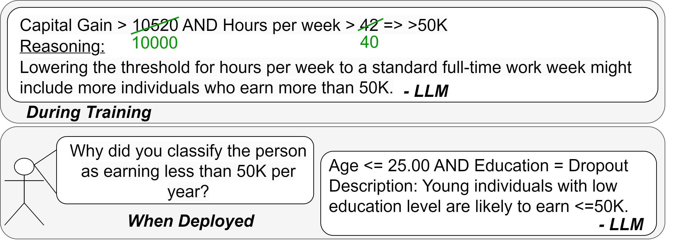

# MoRE-LLM: Mixture of Rule Experts Guided by a Large Language Model (ICDM 2024)

This repository contains the code related to the paper MoRE-LLM: Mixture of Rule Experts Guided by a Large Language Model, published at ICDM 2024.

Mixture of Rule Experts guided by a Large Language Model (MoRE-LLM) combines a data-driven black-box model with knowledge extracted from an LLM to enable domain knowledge-aligned and transparent predictions.

 

## Usage

To install requirements use:
```
pip install -r ./requirements.txt
```

To use a cloud based OpenAI LLM model for rule refinement set the API access in ```more.py```:
```
454        if use_llm:
455            self.client = None #TODO: define your OpenAI API access here
``` 

The results in the paper are generated using GPT4 with following command:

```
python run_more.py --seed 0 --epsilon 0.1 --with-llm 1 --max-steps 5 --lr 0.001 --epochs-unconst 1000 --epochs-const 1000 --batch-size 32 --log-path ./
```

- To use a LR model set ```--linear 1```

- To exclude LLM based refinement step ```--with-llm 0```

- Implemented datasets: adult, german (g-credit), and diabetes

## Citation
In case you find this work useful please cite:

```
@inproceedings{koebler2024more,
  author={Koebler, Alexander and Thon, Ingo and Buettner, Florian},
  booktitle={2024 IEEE International Conference on Data Mining (ICDM)}, 
  title={MoRE-LLM: Mixture of Rule Experts Guided by a Large Language Model}, 
  year={2024}}
```
